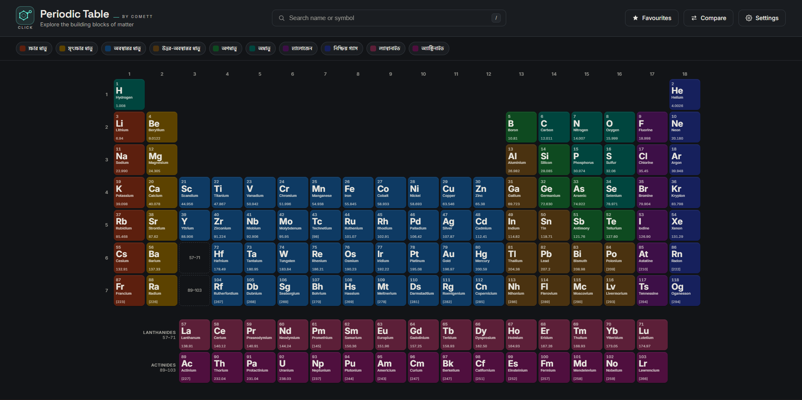

# Periodic Table by Comett

An interactive, single-file periodic table web app.

🔗 **Live demo:** https://dualwielder.github.io/periodic-table-comett/

## Features
- All 118 elements with detailed info panels
- 8 themes (light, dark, sepia, neon, sylvan, orchid, crimson, mono)
- Search, category filters and favourites
- Interactive 3D atom model
- Periodic trends heatmap
- Compare two elements side by side
- Bangla descriptions
- Responsive layout and print-friendly stylesheet
- Accessibility options (reduced motion, high contrast)

## Usage
Just open `index.html` in any modern browser. No build step or dependencies.

## Author
Made by Comett.

## License
MIT
